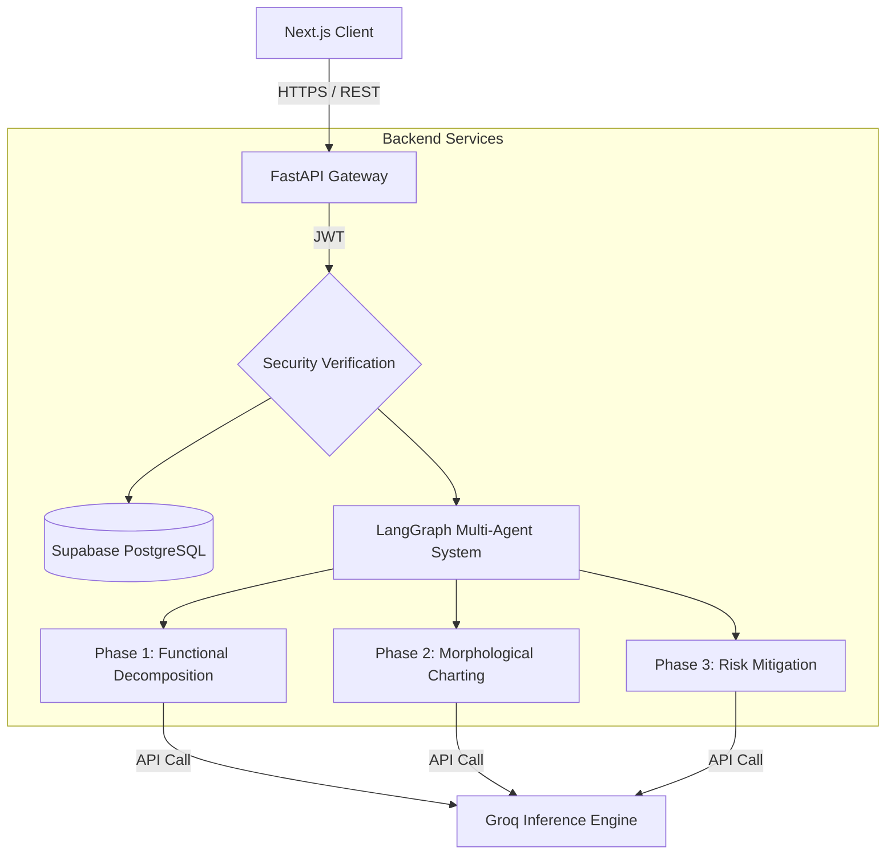

# ProtoStruc: Enterprise Engineering Design Platform

**ProtoStruc is an enterprise-grade, AI-assisted product development ecosystem designed to streamline and automate hardware and software engineering methodologies. It leverages cutting-edge multi-agent systems via LangGraph to handle Functional Decomposition, Morphological Analysis, and Risk Mitigation directly inside a comprehensive dashboard.**

---

## 📑 Table of Contents

1. [System Overview](#1-system-overview)
2. [Architecture Landscape](#2-architecture-landscape)
3. [Technology Stack](#3-technology-stack)
4. [Multi-Agent AI Workflow](#4-multi-agent-ai-workflow)
5. [Authentication & Security](#5-authentication--security)
6. [Repository Structure](#6-repository-structure)
7. [Deployment Infrastructure](#7-deployment-infrastructure)
8. [Local Development Setup](#8-local-development-setup)

---

## 1. System Overview

ProtoStruc digitizes the classic Systems Engineering product development lifecycle. Rather than relying on manual whiteboarding or fragmented documents, ProtoStruc utilizes deterministic Generative AI agents to systematically decompose ideas, explore physical solutions, and stress-test failure modes prior to physical prototyping. This approach isolates operational API logic from intensive artificial intelligence processing, preventing computational bottlenecks.

## 2. Architecture Landscape

The application employs a decoupled, client-server topology. The separation of concerns guarantees that AI token generation wait times do not paralyze frontend interactivity.



## 3. Technology Stack

### 3.1 Frontend (User Interface)
- **Core Framework**: Next.js (App Router paradigm)
- **Styling**: Tailwind CSS combined with `shadcn/ui` tailored components
- **Interactivity**: Framer Motion for micro-animations and smooth layout transitions
- **Assets**: Lucide React for standardized iconography

### 3.2 Backend (Core Logic & AI)
- **3.2.1 Web Server**: FastAPI (Python) enforcing strict Pydantic schematics
- **3.2.2 LLM Provider**: Groq API leveraging `llama-3.3-70b-versatile` for deep contextual reasoning and `llama-3.1-8b-instant` for rapid validation
- **3.2.3 AI Multi-Agent Framework – LangGraph**: LangGraph is utilized as the core orchestration engine to handle stateful, multi-agent AI execution. It elevates standard AI prompts into reliable, enterprise-grade logic pipelines.
  - **Deterministic Workflow Enforcement**: Replaces open-ended conversational loops with rigid, rule-based state machines. The progression from one phase of the engineering lifecycle to the next is strictly gated by validation checks, ensuring that output schemas and logic constraints are met before subsequent agents are triggered.
  - **Multi-Stage Reasoning Capability**: Breaks down the monumental task of full product engineering into discrete, manageable sub-tasks. Each agent handles a specific cognitive load (e.g., extracting functions, generating physical mappings, analyzing risk) while retaining access to the shared global state space across graph iterations.
  - **Graph-Based Structured Agent Flows**: Models the engineering workflow as a cyclical graph of nodes (Generator agents, Validator agents, Output Parsers) and edges (Conditional routing logic). This granular topology makes the AI process observable, debuggable, and highly modular.
  - **Prevents Uncontrolled or Random LLM Responses**: Instead of allowing the LLM to hallucinate free-form text, the framework uses internal "Validator Nodes" to intercept and scrutinize outputs. If an LLM deviates from the required engineering bounds, LangGraph forcefully loops it backward with specific, automated corrective feedback until compliance is achieved.
  - **Enables Strict Step-by-Step Execution**: Guarantees that phase dependencies are absolutely respected. For instance, Morphological Analysis (Phase 2) cannot commence until the Functional Decomposition (Phase 1) is 100% complete, numerically verified, and committed to the graph state. This mimics a true sequential engineering pipeline.
- **3.2.4 Data Persistence**: Supabase (PostgreSQL relational clusters)

---

## 4. Multi-Agent AI Workflow

The AI engine mirrors collegiate and industry-standard product development pathways utilizing deterministic sequences driven by LangChain and Groq. Each phase employs a dual-agent architecture: an ideation Generator model (`llama-3.3-70b-versatile` set to temperature 0.7 for high context) and a strict numerical Validator model (`llama-3.1-8b-instant` set to temperature 0.0 for rule adherence).

### Phase 1: Functional Decomposition
The system ingests a high-level problem statement and recursively builds an exhaustive abstract breakdown structure prior to physical design.
- **Depth Constraints**: Generator enforces a strict 3-tier hierarchy requiring `MainFunction` -> `SubFunction` -> `SubSubFunction` mappings, extracting 5-10 Level 1 Main Functions before deep-diving into Sub-levels.
- **Verb+Noun Paradigm**: The AI is prompted to strictly enforce functionality through 'Verb + Noun' patterns (e.g., 'remove material', not 'grind wood'). It separates functional requirement from actual implementation.
- **Flow Definition (Pahl & Beitz)**: Every layer tracks distinct logic paths for `Material Flow`, `Energy Flow`, and `Information Flow`.
- **Validation**: An autonomous Validator agent cross-verifies that NO physical components or specific software frameworks leak into the abstraction. If hallucinated solutions are detected, the validator rejects the payload and returns specific corrective feedback to the generator.

### Phase 2: Morphological Charting (Ideation)
The engine consumes the validated Phase 1 JSON output to extrapolate 5-10 distinct physical or computational solution principles for every Level 1 Main Function.
- **Matrix Extrapolation**: Generates a matrix mapping abstract functional requirements to tangible solution vectors (e.g., mapping "store data" to solutions like SQL clusters, rule-based logic tapes, or blockchain hashes).
- **Physical Independence**: Enforces independence, ensuring solutions can be dynamically grouped together to satisfy core constraints (physical bounds for mechanical logic, algorithmic logic for digital pipelines).
- **Validation**: The Phase 2 Validator calculates uniqueness limits, ensuring that every function receives at least 3 distinct options entirely devoid of non-physical abstractions. Null mappings result in an immediate fail-retry response.

### Phase 3: Risk Analysis (FMEA/SWOT Simulation)
Constructs a hyper-detailed SWOT (Strengths, Weaknesses, Opportunities, Threats) matrix against the Morphological Chart matrix. 
- **Exhaustive Mapping**: Every single alternative generated in Phase 2 receives its own independent SWOT extraction matrix. 
- **Engineering Specification Rule**: The agent is restricted from producing general business, market, or marketing trade-offs. It explicitly outputs technical engineering bounds, analyzing physical triggers (like induced friction, computational latency) alongside engineering trade-offs (e.g., precision vs. operational cost).
- **Validation**: The Phase 3 Validator compares the ingested Morphological array dimension against the returned SWOT vector dimension. If even one SWOT node is missing or non-technical, the entire array is failed and sent back for recalculation.

---

## 5. Authentication & Security

- **JWT Minting**: ProtoStruc utilizes localized JSON Web Token minting pipelines verified against the Supabase database.
- **Session Handling**: Bearer tokens are intercepted and mapped to User UUIDs natively at the API layer.
- **Secure Resets**: Password reset triggers rely on `uuid_generate_v4()` mapping natively in PostgreSQL, generating highly ephemeral (15-minute) expiration windows localized to UTC bounds to prevent replay attacks.

---

## 6. Repository Structure

```text
IP_Deployment/
├── frontend/                 # Client UI
│   ├── src/app/              # Next.js Routing
│   ├── src/components/       # Isolated React modules
│   └── src/lib/              # Local utilities & API hooks
├── backend/                  # Server Engine
│   ├── app/ai/               # LangGraph/Groq Nodes (Phase 1, 2, 3)
│   ├── app/api/              # JWT Routes
│   └── app/models/           # Pydantic Schemas & DB ORMs
├── ARCHITECTURE.md           # Structural technical details
├── DEPLOYMENT.md             # CI/CD deployment mechanics
└── README.md                 # Brief introduction
```

---

## 7. Deployment Infrastructure

The environment uses continuous integration to distinct microservice platforms.

- **Frontend Edge Delivery**: Hosted on **Vercel** to utilize zero-configuration edge caching and static generation optimization.
- **Backend Compute Layer**: Hosted on **Render** (Web Services) to provide dedicated CPU environments capable of handling sustained Python processing loads.

---

## 8. Local Development Setup

### Database Initialization
Requires an active Supabase cluster containing populated `users` and `password_resets` schema architectures.

### Backend Virtual Environment
```bash
cd backend
python -m venv venv
# Activate the environment
source venv/bin/activate       # Mac/Linux
.\venv\Scripts\activate        # Windows
# Install dependencies
pip install -r requirements.txt
# Launch API Gateway
uvicorn app.main:app --reload
```

### Frontend Node Setup
```bash
cd frontend
npm install
# Run Development Server
npm run dev
```

> **Note:** Establish required environment variables `SUPABASE_URL`, `SUPABASE_KEY`, `GROQ_API_KEY`, etc. locally using a `.env` file prior to booting the endpoints.
